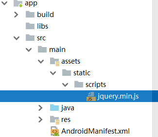

# CacheWebView

[](https://bintray.com/yale8848/maven/CacheWebView/2.1.8)

  CacheWebView is a custom implement of Android WebView resource interceptor. It beyond system WebView cache space
  limit, let cache config more simple ,fast and flexible. Visit website by offline.

## Why use CacheWebView?

- let WebView cache space more bigger
- force cache static, it will more fast
- want to get web page resource in cache, e.g , get pic in cache

## Usage

### use lib

```groovy
compile 'ren.yale.android:cachewebviewlib:2.1.8'
```


### Change code

Init in Application

```

    WebViewCacheInterceptorInst.getInstance().
                init(new WebViewCacheInterceptor.Builder(this));

```


Add WebView Interceptor

- If your Android project minSdkVersion>=21

```
    mWebView.setWebViewClient(new WebViewClient(){

            @TargetApi(Build.VERSION_CODES.LOLLIPOP)
            @Nullable
            @Override
            public WebResourceResponse shouldInterceptRequest(WebView view, WebResourceRequest request) {
                return  WebViewCacheInterceptorInst.getInstance().interceptRequest(request);
            }

            @Nullable
            @Override
            public WebResourceResponse shouldInterceptRequest(WebView view, String url) {
                return  WebViewCacheInterceptorInst.getInstance().interceptRequest(view,url);
            }
     });

```

- If your Android project minSdkVersion<21

when call `mWebView.loadUrl(url)` replace by `WebViewCacheInterceptorInst.getInstance().loadUrl(mWebView,url)`

```

    mWebView.setWebViewClient(new WebViewClient(){


            @TargetApi(Build.VERSION_CODES.LOLLIPOP)
            @Override
            public boolean shouldOverrideUrlLoading(WebView view, WebResourceRequest request) {
                WebViewCacheInterceptorInst.getInstance().loadUrl(mWebView,request.getUrl().toString());
                return true;
            }

            @Override
            public boolean shouldOverrideUrlLoading(WebView view, String url) {
                WebViewCacheInterceptorInst.getInstance().loadUrl(mWebView,url);
                return true;
            }

            @TargetApi(Build.VERSION_CODES.LOLLIPOP)
            @Nullable
            @Override
            public WebResourceResponse shouldInterceptRequest(WebView view, WebResourceRequest request) {
                return  WebViewCacheInterceptorInst.getInstance().interceptRequest(view, request);
            }

            @Nullable
            @Override
            public WebResourceResponse shouldInterceptRequest(WebView view, String url) {
                return  WebViewCacheInterceptorInst.getInstance().interceptRequest(view,url);
            }
    });

```

---

### Setting

 - Basic

 ```Java
    WebViewCacheInterceptor.Builder builder =  new WebViewCacheInterceptor.Builder(this);

     builder.setCachePath(new File(this.getCacheDir(),"cache_path_name"))//set cache path, default getCacheDir, name CacheWebViewCache
                        .setCacheSize(1024*1024*100)//set cache size, default 100M
                        .setConnectTimeoutSecond(20)//set http connect timeou,default 20 seconds
                        .setReadTimeoutSecond(20)//set http read timeout,default 20 seconds
                        .setCacheType(CacheType.NORMAL);//set cache modal is normal, default is force cache static modal

     WebViewCacheInterceptorInst.getInstance().init(builder);
 ```

- set cache suffix

CacheWebview according url suffix to cache, you can add and remove suffix

```Java
    WebViewCacheInterceptor.Builder builder =  new WebViewCacheInterceptor.Builder(this);

    CacheExtensionConfig extension = new CacheExtensionConfig();
    extension.addExtension("json").removeExtension("swf");

    builder.setCacheExtensionConfig(extension);

    WebViewCacheInterceptorInst.getInstance().initAssetsData();//background thread to get assets files
    WebViewCacheInterceptorInst.getInstance().init(builder);
```

default cached suffix

```
    private static HashSet STATIC = new HashSet() {
        {
            add("html");
            add("htm");
            add("js");
            add("ico");
            add("css");
            add("png");
            add("jpg");
            add("jpeg");
            add("gif");
            add("bmp");
            add("ttf");
            add("woff");
            add("woff2");
            add("otf");
            add("eot");
            add("svg");
            add("xml");
            add("swf");
            add("txt");
            add("text");
            add("conf");
            add("webp");
        }
    };

```

default do not cached suffix

```
    private static HashSet NO_CACH = new HashSet() {
        {
            add("mp4");
            add("mp3");
            add("ogg");
            add("avi");
            add("wmv");
            add("flv");
            add("rmvb");
            add("3gp");
        }
    };
```

- set Assets dir

CacheWebview can get static from Assets, if you set Assets dir, it will read static from Assets, default is not

```
    WebViewCacheInterceptor.Builder builder =  new WebViewCacheInterceptor.Builder(this);

    builder.setAssetsDir("static");

    WebViewCacheInterceptorInst.getInstance().init(builder);
```

builder.setAssetsDir("static") match regular：

assets struct：



if match like this url：http://xxxxxx/scripts/jquery.min.js , it will be read static from Assets


- custom interceptor role

```
    builder.setResourceInterceptor(new ResourceInterceptor() {
            @Override
            public boolean interceptor(String url) {
                return true;
            }
        });
```


- get cache file

```

    String url = "http://m.mm131.com/css/at.js";
    InputStream inputStream =  WebViewCacheInterceptorInst.getInstance().getCacheFile(url);
    if (inputStream!=null){

    }

```

- clear cache file

```
    WebViewCacheInterceptorInst.getInstance().clearCache();
```

- set force cache disable

  after set force cache disable, Webview will load static by itself

```
    WebViewCacheInterceptorInst.getInstance().enableForce(false);
```

- None singleton used

**call method same as singleton**

```
    WebViewCacheInterceptor.Builder builder =  new WebViewCacheInterceptor.Builder(this);
    WebViewRequestInterceptor webViewRequestInterceptor = builder.build();
    webViewRequestInterceptor.getCacheFile("");
```

## Proguard

```
#CacheWebview
-dontwarn ren.yale.android.cachewebviewlib.**
-keep class ren.yale.android.cachewebviewlib.**{*;}

#okhttp
-dontwarn okhttp3.**
-keep class okhttp3.**{*;}

#okio
-dontwarn okio.**
-keep class okio.**{*;}
```

## How to contribute

   [Contributing Guide](https://github.com/yale8848/CacheWebView/blob/master/CONTRIBUTING.md)
